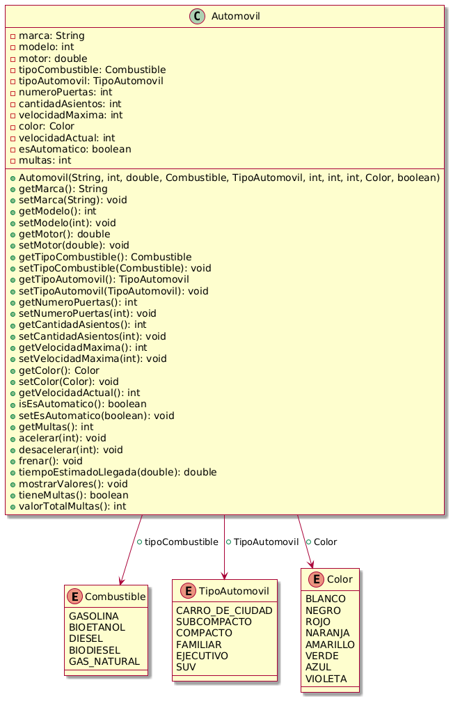

# Java_8th_Exercise_Automovil

mkdir Java_8th_Exercise_Automovil 
cd Java_8th_Exercise_Automovil 
mkdir -p src/main/java/com/example/automovil/model 
mkdir -p src/main/java/com/example/automovil/service 
mkdir -p src/main/java/com/example/automovil/enums 
mkdir -p src/test/java/com/example/automovil/service 

Enunciado:
Se requiere un programa que modele el concepto de un automóvil. Un automóvil tiene los siguientes atributos: 
-Marca: el nombre del fabricante. 
-Modelo: año de fabricación. 
-Motor: volumen en litros del cilindraje del motor de un automóvil. 
-Tipo de combustible: valor enumerado con los posibles valores de gasolina, bioetanol, diésel, biodiésel, gas natural. 
-Tipo de automóvil: valor enumerado con los posibles valores de carro de ciudad, subcompacto, compacto, familiar, ejecutivo, SUV. 
-Número de puertas: cantidad de puertas. 
-Cantidad de asientos: número de asientos disponibles que tiene el vehículo. 
-Velocidad máxima: velocidad máxima sostenida por el vehículo en km/h. 
-Color: valor enumerado con los posibles valores de blanco, negro, rojo, naranja, amarillo, verde, azul, violeta. 
-Velocidad actual: velocidad del vehículo en un momento dado. 
.
.

# Estructura del Proyecto
Java_8th_Exercise_Automovil/ 
├── src/ 
│   ├── main/ 
│   │   ├── java/ 
│   │   │   └── com/ 
│   │   │       └── automovil/ 
│   │   │           ├── enums/ 
│   │   │           │   ├── Combustible.java 
│   │   │           │   ├── TipoAutomovil.java 
│   │   │           │   └── Color.java 
│   │   │           ├── model/ 
│   │   │           │   └── Automovil.java 
│   │   │           ├── service/ 
│   │   │           │   └── AutomovilService.java 
│   │   │           └── Main.java 
│   └── test/ 
│       ├── java/ 
│       │   └── com/ 
│       │       └── automovil/ 
│       │           └── service/ 
│       │               └── AutomovilServiceTest.java 
├── .vscode/ 
│   └── settings.json 
├── .gitignore 
├── pom.xml 
└── README.md 
└── UML/ 
    └── Diagrama_de_Clases.png 

Entregable:
- Repositorio de git
- Obligatorio realizar los pruebas unitarias

# Diagrama de Clases
[UML]https://www.planttext.com/

# Texto Enunciado:
[Link Enunciado Automovil]https://docs.google.com/document/d/1HSwCVitQpPok5EwDl61T0VQKN-uPVGkjE3AkqKhbedo/edit